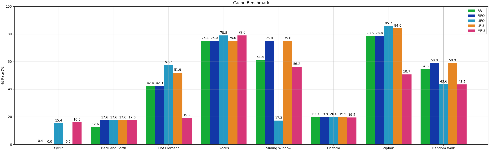

# 💾 Cache

By default, accessing a Pipewine dataset via the `__getitem__` method often implies calling a function that performs some computation and then constructs a new Sample object. Furthermore, accessing items on a sample may require a read from external storages e.g. a file system or a remote DB. 

When dealing with deterministic operations (i.e. same inputs imply the same outputs) it makes little sense to perform these computations and/or reads more than once: we could store the output of the first call and then, for every successive call, just look it up and return it. 

That's a technique called *Memoization* that while being very effective at speeding computation up, it also has no bound on the number of elements it keeps stored, meaning that it will eventually end up using all the available memory on our system, if the data we are trying to store does not entirely fit in system memory.

Note that if we had the guarantee that every dataset could fit in the system memory, we could just apply every operation eagerly and avoid dealing with this caching headache altogether, but unfortunately (a) it's surprisingly common to deal with datasets that cannot fit in your system's RAM and (b) even if they did, would you be ok with Pipewine using 95% of your system memory?

Pipewine has some built-in tools to provide a reasonable trade-off between (a) wasting time performing the same computation multiple times but minimizing the memory usage and (b) eliminating all waste but keeping everything memorized, because often, something in between these two extreme cases is highly preferable. 

Pipewine allows you to cache data in three different ways:

- Cache at the item level, to accelerate consecutive accesses to the same item object, mainly to avoid multiple I/O for the same data.
- Cache at the dataset level, to accelerate consecutive accesses (`__getitem__`) to the same dataset, avoiding the re-computation of lazy operations.  
- Checkpoints, to save all intermediate results to disk (applying all the lazy operations) and then read the results.

!!! Note

    There is no cache at the sample level, because sample objects receive all their items at construction time and they always own a reference to all items they contain, making them always immediately available. 

## Item Cache

Item cache converts all items of a sample into `CachedItem` instances. As you may have seen on the previous section of this tutorial, `CachedItem` is a wrapper of a regular ` Item` store the result of the `__call__` method when called for the first time, then, every subsequent call simply returns the stored value without calling the inner item twice. `CachedItem` are lightweight and computationally inexpensive, they merely store a reference and return it.

The `__call__` method of a stored item implies a read from disk (or other sources),
calling it multiple times results in the slow read operation being repeated!

!!! example

    Very slow code, without item cache every time we access the "image" item we read it from disk!

    This runs in approximately 130 ms on my system. 

    ``` py
    dataset = UnderfolderSource(Path("my_dataset"))()
    sample = dataset[0]

    for _ in range(1000):
        sample["image"]()
    ```

We can improve this situation by using item caches, storing the result of the first read, then immediately return it in every subsequent call.

!!! example

    Same code with item caches, this time it takes only 0.2 ms!

    ``` py
    dataset: Dataset = UnderfolderSource(Path("my_dataset"))()
    dataset = ItemCacheOp()(dataset)
    sample = dataset[0]
    
    for _ in range(1000):
        sample["image"]()
    ```

Contrary to Pipelime, item caches die with the sample object: whenever we index the dataset, we get a brand new sample object with newly created (thus empty) `CachedItem` instances.


!!! warning

    Even though we call `ItemCacheOp`, this is as slow as the first example where we did not use item caching at all! 

    This is because the sample is re-created every time we index the dataset.
    ``` py
    dataset: Dataset = UnderfolderSource(Path("my_dataset"))()
    dataset = ItemCacheOp()(dataset)
    
    for _ in range(1000):
        dataset[0]["image"]()
    ```

This also means that unless you keep references to samples, you cannot possibly blow up your memory using item cache.

A few tips on item caches:

!!! tip

    Use `ItemCacheOp` when you need to access the same item on the same sample multiple times and you want to avoid reading from disk.

    The following code runs in approximately 19ms on my system. Without item caches, it would take 29ms, roughly 50% longer!

    ``` py
    def function1(sample: Sample) -> None:
        print("Average Color: ", sample["image"]().mean((0, 1)))


    def function2(sample: Sample) -> None:
        print("Color Standard Deviation: ", sample["image"]().std((0, 1)))


    if __name__ == "__main__":
        path = Path("tests/sample_data/underfolders/underfolder_0")

        dataset = UnderfolderSource(path)()
        dataset = ItemCacheOp()(dataset)

        for sample in dataset:
            function1(sample)
            function2(sample)
    ```

!!! tip

    Results of previous operations are always stored inside `MemoryItems`. It makes no sense to cache those.

!!! tip

    If you only access an item once for every sample in the dataset, your code won't benefit from using item cache.


## Dataset Cache

Item caches are very simple, inexpensive and relatively safe to use, but they cannot do anything about repeated computations of lazy operations. 

Let's consider the following example: 

!!! example

    We have a dataset of 26 samples, for each of them we compute statistics about an item named "image", like the average color, the standard deviation, the minimum and maximum pixel values. We then repeat the results 100 times to artificially increase the dataset length.

    ``` py
    class ComputeStatsMapper(Mapper[Sample, Sample]):
        def __call__(self, idx: int, x: Sample) -> Sample:
            image: np.ndarray = x["image"]()
            mean = image.mean((0, 1)).tolist()
            std = image.std((0, 1)).tolist()
            min_, max_ = int(image.min()), int(image.max())
            stats_item = MemoryItem(
                {"mean": mean, "std": std, "min": min_, "max": max_}, YAMLParser()
            )
            return x.with_item("stats", stats_item)


    path = Path("tests/sample_data/underfolders/underfolder_0")

    dataset = UnderfolderSource(path)()
    dataset = MapOp(ComputeStatsMapper())(dataset)
    dataset = RepeatOp(100)(dataset)

    for sample in dataset: 
        print(sample["stats"]())
    ``` 

    The code above runs (on my system) in about 750 ms. That's a very long time, even considering the slow speed of the Python interpreter. That's because `RepeatOp` is lazy, and the i-th sample is only computed when the dataset is indexed. In total, the dataset is indexed 26 * 100 = 2600 times, each time computing the image stats from scratch:

    - User requests sample 0 -> maps to sample 0 of original dataset -> compute stats on image 0
    - User requests sample 1 -> maps to sample 1 of original dataset -> compute stats on image 1
    - ...
    - User requests sample 26 -> maps to sample 0 of original dataset -> compute stats on image 0
    - User requests sample 27 -> maps to sample 1 of original dataset -> compute stats on image 1
    - ...

    If the program were run eagerly (that's not the case with Pipewine), the stats were computed on the 26 original images, then the results would be repeated 100 times with virtually no cost.

    To solve this problem we can use `CacheOp`, a special operator that adds a layer of cache to the result of an operation, combined with `MemoCache`, a very simple cache that memorizes everything with no bound on the number of cached elements.

    ``` py
    dataset = UnderfolderSource(path)()
    dataset = MapOp(ComputeStatsMapper())(dataset)
    dataset = CacheOp(MemoCache)(dataset)  # <- Activates dataset caching
    dataset = RepeatOp(100)(dataset)

    for sample in dataset: 
        print(sample["stats"]())
    ```

    The code now runs in 45 ms and the stats computation is only performed 26 times:

    - User requests sample 0 -> maps to sample 0 of original dataset -> compute stats on image 0 -> cache result 0
    - User requests sample 1 -> maps to sample 1 of original dataset -> compute stats on image 1 -> cache result 1
    - ...
    - User requests sample 26 -> maps to sample 0 of original dataset -> return cached sample 0
    - User requests sample 27 -> maps to sample 1 of original dataset -> return cached sample 1
    - ...

As you might have noticed, `CacheOp` can be parametrized with the type of cache to use, and optionally implementation-specific parameters to further customize the way data is cached. There is no silver bullet here, and the type of cache you should use strongly depends on the order the data is accessed, and if chosen wrongly it can lead to 0% hit rate: the worst case scenario where you pay the price of increased memory utilization, additional overhead, and get nothing in return.

!!! Note

    `CacheOp`, regardless of the policy, always applies item-level caching and inherits all its benefits.

    This is useful because if you want dataset-level caching, you probably want item-level caching as well, sparing you the effort of always applying two `ItemCacheOp` after `CacheOp`.

For Pipewine, `Cache` objects are anything that behaves like this:

``` py
class Cache[K, V]:
    def clear(self) -> None: ... # <- Removes everything from the cache.
    def get(self, key: K) -> V | None: ... # Return the value of key, if any.
    def put(self, key: K, value: V) -> None: ... # Assign a value to a key.
```

Let'see the available cache types, together with their pros and cons.

### MemoCache

`MemoCache` is a basic memoization. It can only grow in size since it never evicts elements and has no upper bound to the number of elements it can keep memorized.

Access and insertion are both O(1) and are the fastest among all the cache types implemented in Pipewine.

!!! success

    Best used to cache the output of long computations where either:

    - The number of samples in the dataset is small (better if known a-priori).
    - The size of the cached data is relatively small. 
    - You don't care about memory, you just want to always guarantee the maximum possible cache hit rate by brute-force.

!!! failure

    `MemoCache` is unbounded: it may end up using all the available memory on your system.


### RRCache

`RRCache` is a bounded cache that follows a stochastic replacement rule. Whenever an element needs to be added to the cache and no space is available, the cache will make space by evicting a random element.

Access and insertion are both O(1). Access is exactly as fast as with `MemoCache`, insertion includes additional overhead due to the RNG.

!!! success

    You can use a random replacement cache when the order in which samples are accessed is unknown, but still you want to statistically do better than the worst case scenario (0% hit rate).

!!! failure

    Random replacement cache is not optimal if:

    - You need deterministic running time.
    - You know the order in which samples are accessed and you can select a more appropriate cache type.

### FIFOCache

`FIFOCache` is a bounded cache that stores element in a queue data structure. Whenever an element needs to be added to the cache and no space is available, the cache will make space by evicting the element that was least recently **inserted** in the cache (not to be confused with LRU caches), regardless of how many times they were accessed before.

Basically, the first element that is inserted is going to be the first that gets evicted.

Access and insertion are both O(1). Access is exactly as fast as with `MemoCache`, insertion includes additional overhead due the eviction policy implementation.

!!! success

    Use `FIFOCache` when an element is likely going to be accessed multiple times shortly after being inserted in the cache.

!!! failure

    The FIFO eviction policy guarantees a 0% hit rate when the elements are accessed in order from first to last in multiple cycles. 

### LIFOCache

`LIFOCache` is a bounded cache that stores element in a stack data structure. Whenever an element needs to be added to the cache and no space is available, the cache will make space by evicting the element that was most recently **inserted** in the cache (not to be confused with MRU caches), regardless of how many times they were accessed before.

Basically, the first element that is inserted is going to be the last that gets evicted.

Access and insertion are both O(1), same cost as with `FIFOCache`. 

!!! success

    Use `LIFOCache` when:
    
    - Elements are accessed in order from first to last in multiple cycles.  
    - The first elements to be inserted are likely going to be accessed more frequently.  

!!! failure

    The LIFO eviction policy performs terribly when recently inserted elements are likely going to be accessed in subsequent, but not immediately consecutive, calls.

### LRUCache

`LRUCache` (Least Recently Used Cache) is a bounded cache that whenever an element needs to be added and no space is available, it will forget the element that was least recently **accessed**. In contrast with the `FIFOCache`, the eviction policy takes into account the way elements are accessed, making this solution slightly more complex.

Access and insertion are both O(1), both include additional overhead due to potential state changes in the underlying data structure. The implementation is a modified version of the one proposed in the Python3.12 standard library that uses a circular doubly linked list + hashmap. 

!!! success

    Use `LRUCache` when an element that was recently accessed is likely going to be accessed again in the future.

!!! failure

    The LRU eviction policy guarantees a 0% hit rate when the elements are accessed in order from first to last in multiple cycles, similarly to `FIFOCache`.

### MRUCache

`MRUCache` (Most Recently Used Cache) is a bounded cache that whenever an element needs to be added and no space is available, it will forget the element that was most recently **accessed**. In contrast with the `LIFOCache`, the eviction policy takes into account the way elements are accessed, making this solution slightly more complex.

Access and insertion are both O(1), same costs as `LRUCache`. 

!!! success

    Use `MRUCache` when:
    
    - Elements are accessed in order from first to last in multiple cycles.  
    - Elements that are recently accessed are likely not going to be accessed again for a long time.

!!! failure

    The MRU eviction policy performs terribly when recently inserted elements are likely going to be accessed in subsequent calls.

### Benchmark

Here is a very naive benchmark of different cache eviction policies compared under different access patterns, under the following conditions:

- The dataset consists of 26 elements.
- The total number of calls is 26000.
- The maximum cache size is set to 5.

Types of access patterns used:

- "Cyclic" accesses elements from first to last in multiple cycles. E.g.
  
    `0 1 2 3 4 5 6 7 8 9 0 1 2 3 4 5 6 7 8 9 ...`

- "Back and Forth" accesses elements from first to last in even cycles, and from last to first in odd cycles. E.g. 

    `0 1 2 3 4 5 6 7 8 9 9 8 7 6 5 4 3 2 1 0 0 1 2 3 ...`

- "Hot Element" accesses the elements similarly to "Cyclic" in odd indexes, but in every even index it accesses the first "hot" element:

    `0 0 0 1 0 2 0 3 0 4 0 5 0 6 0 7 0 8 0 9 0 0 0 1 0 2 ...`

- "Blocks" accesses the elements similarly to "Cyclic" in odd indexes, but in chunks of K elements. E.g. with K=4:

    `0 0 0 0 1 1 1 1 2 2 2 2 3 3 3 3 4 4 4 4 5 5 5 5 ...`

- "Sliding Window" accesses the elements in groups of K increasing indexes. E.g. with K=4:

    `0 1 2 3 1 2 3 4 2 3 4 5 3 4 5 6 4 5 6 7 5 6 7 8 6 7 8 9 ...`

- "Uniform" accesses the elements in random order, sampling from a uniform distribution.
- "Zipfian" accesses the elements in random order, sampling from a zipfian distribution.
- "Random Walk" accesses the items in random order, where the i-th index is computed by adding a random shift from the previous one, sampled from a normal distribution with a small positive shift.



## Checkpoints

So far we have seen how to mitigate the problem of multiple accesses to the same item using `ItemCacheOp` cache and how to avoid re-computing the same lazy operation when accessing a dataset with the same index multiple times `CacheOp`. Pipewine has a final caching mechanism called "checkpoint" that can be used when both:

- Datasets are not guaranteed to entirely fit into system memory. E.g. using `MemoCache` would crash your pipeline.
- Some operations are very slow and the risk of computing them multiple times due to a cache miss is unacceptable. In this case using any policy other than `MemoCache` would not eliminate this risk entirely.

Checkpoints are a rather stupid but effective idea to deal with this situation: we eagerly write the whole dataset to disk (or to a DB) and then return a lazy dataset that reads from it. 

This way we use disk space (which we can safely assume to be enough to store the dataset) to cache intermediate results, so that future accesses won't have to re-compute all the lazy operations that were needed to reach that intermediate state.

!!! tip

    Checkpoints are not a free lunch: you shift the cost from computation to I/O. 
    As a very approximate rule of thumb, under many simplifying assumptions, checkpoints should be convenient if:
    
        (N - 1) * compute_cost > (N + 1) * io_cost

    Where `N` is the average number of times that the same computation is repeated, `compute_cost` is the total cost of computing all computations once, `io_cost` is the total cost of reading or writing the results of all comptuation once. 

Checkpoints are currently not a class or any software component you can import from Pipewine, they are a functionality of Pipewine [Workflows](workflows.md), a higher level concept that was not explained in this tutorial so far. However, you don't need Workflows to use checkpoints, you can simply use a pair of a `DatasetSink` and `DatasetSource`.

!!! note

    When using workflows, placing a checkpoint in the middle of a pipeline is way easier than this: all you need to do is set a boolean flag `checkpoint=True` where needed, or, if you want to use a checkpoint after every single operation, you can set a flag to enable them by default.
    
    Refer to the [Workflows](workflows.md) section for more info.

!!! example

    A rather extreme example of checkpoint usage: starting from the "letters" toy dataset used in the examples so far, we want to replace the 26 (badly) hand-drawn images with AI-generated ones. Then, we want to replicate the whole dataset 100 times.

    Yes, we only want to generate a total of 26 images, not 2600, using Gen-AI.

    Suppose we have access to an API that costs us 1$ per generated image and we wrapped that into a `Mapper`:

    ``` py
    class RegenerateImage(Mapper[Sample, Sample]):
        def __call__(self, idx: int, x: Sample) -> Sample:
            metadata = x["metadata"]()
            letter, color = metadata["letter"], metadata["color"]
            prompt = (
                f"Create an artistic representation of the letter {letter} in a visually "
                f"striking style. The letter should be prominently displayed in {color}, "
                "with a background that complements or contrasts it artistically. Use "
                "textures, lighting, and creative elements to make the design unique "
                "and aesthetically appealing."
            )
            gen_image = extremely_expensive_api_that_costs_1_USD_per_image(prompt)
            return x.with_value("image", gen_image)
    ```

    To (correclty) generate only 26 images, then repeat the whole dataset 100 times, we can use a checkpoint just after applying the `RegenerateImage` mapper:

    ``` py
    path = Path("tests/sample_data/underfolders/underfolder_0")
    dataset = UnderfolderSource(path)()
    dataset = MapOp(RegenerateImage())(dataset)

    # Checkpoint
    UnderfolderSink(ckpt := Path("/tmp/ckpt"))(dataset)
    dataset = UnderfolderSource(ckpt)()

    dataset = RepeatOp(100)(dataset)
    ```

    Without the checkpoint, we would instead call the API a total of 2600 times, generating 100x more images than we originally intended and wasting a lot of money.

## Cache and Multi-processing

Multiprocessing in python does not allow processes to hold references to arbitrary python objects in shared memory. Besides a restricted set of built-in types, all the communication between processes uses the message passing paradigm. For process A to send an object to process B, many expensive things need to happen:
- A and B need to hold a pair of connected sockets.
- A must serialize the object into bytes.
- A must write the bytes into the socket.
- B must read the bytes from the socket.
- B must de-serialize the bytes into a copy of the original object.

As pointed out in the Python docs, using shared state between multiple processes should be avoided as much as possible, for the following reasons:

- **Synchronization**: when processes need to share state, they need mechanisms like locks, semaphores or other synchronization primitives to prevent race conditions and mess everything up.
- **Performance overhead**: each time an object is passed from one process to the other, it needs to be serialized and de-serialized, which is generally an expensive operation.
- **Memory overhead**: each time an object is passed from one process to the other it is basically as if it were deep-copied, vastly increasing memory usage.
- **Debugging difficulty**: debugging race conditions is not fun, they can be very hard to detect and reproduce.
- **Scalability**: if many processes depend on shared state, the system might not scale well with increasing number of processes due to contention and synchronization overhead.

To avoid these issues Pipewine caches are **not shared** between processes, meaning that if process A computes a sample and caches it, the result will only be cached for process A. Later, if process B needs that sample and looks for it in its own cache, it won't find it and will have to compute it.

The only exception is if the cache was partially populated in the main process: in this case the cache is cloned and every child process inherits its own copy at the moment of spawning. All state changes that occur later are independent for each child process and are discarded when the processes die. No change is reflected on the original copy of the cache in the main process.

We can say that multi-processing makes caching less effective: since processes do not share state and potentially the same sample can be cached multiple times in more than one process we use memory less efficiently. With a pool of N processes we can either have the same hit rate as with a single process by using N times the amount of memory, or we can keep the memory fixed but accomplish a much smaller hit rate.

Checkpoints in contrast, assuming that N python processes are not enough to saturate your read/write bandwith, do not suffer this problem: each sample is written exactly once independently from the others without need for synchronization.

## Comparison with Pipelime

Comparison of cache-related features in Pipelime and Pipewine:

| Feature                        | Pipelime (OLD)                                                                                                                                                                                                                                                                                                                                                                                                                                                                         | Pipewine (NEW)                                                                                                                                                                                                                                                                                                                                                                                             |
| ------------------------------ | -------------------------------------------------------------------------------------------------------------------------------------------------------------------------------------------------------------------------------------------------------------------------------------------------------------------------------------------------------------------------------------------------------------------------------------------------------------------------------------- | ---------------------------------------------------------------------------------------------------------------------------------------------------------------------------------------------------------------------------------------------------------------------------------------------------------------------------------------------------------------------------------------------------------- |
| **Item Cache**                 | Enabled by default, can be disabled with `@no_data_cache()` decorator.                                                                                                                                                                                                                                                                                                                                                                                                                 | Disabled by default, can be enabled by either adding a `ItemCacheOp` or `CacheMapper` where necessary.                                                                                                                                                                                                                                                                                                     |
| **Dataset Cache**              | Depends on how the `SourceSequence` or `PipedSequence` steps of your pipeline are implemented: some of them construct samples when the `__getitem__` is called, others construct them upfront and hold references to them. In the former case, no dataset caching is done. In the latter case, if item caching is not disabled, everything will be memorized as the pipeline progresses. In some cases, it is necessary to turn off caching completely to avoid running out of memory. | Disabled by default, can be enabled by using `CacheOp` with the desired eviction policy. Supports many cache eviction policies to bound the number of cached samples to a safe amount and avoid out of memory issues.                                                                                                                                                                                      |
| **Checkpoints**                | Every `PipelimeCommand` reads inputs and writes outputs from/to external sources, essentially making checkpoints enabled by default for every `PipelimeCommand`. The command also specifies where intermediate steps are written and in which format. Any change in either location and format requires you to apply changes to the command that writes the intermediate result and to every command that reads them.                                                                  | Checkpoints are disabled by default but can be enabled by adding a pair of sink and source between any two steps of the pipeline. The individual steps of the pipeline do not know anything about checkpoints, requiring you to apply no change to your operators.When using workflows Pipewine can be configured to automatically inject a pair of source and sink between any two steps of the pipeline. |
| **Cache and Multi-processing** | No sharing is performed, child processes inherit a copy of the parent process cache. Cache state is lost on process exit.                                                                                                                                                                                                                                                                                                                                                              | Same as Pipelime.                                                                                                                                                                                                                                                                                                                                                                                          |