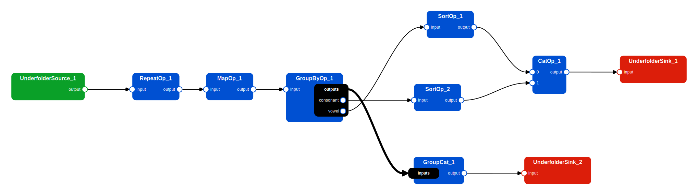

# ♻️ Workflows

## Overwiew

So far in this tutorial we always focused on simple cases where we only needed to apply a single operation to our data, with the only exception of a few cache-related examples where we saw the interactions and side-effects of two lazy operations applied sequentially. 

While applying a single operation to your data may be useful in some situations, more often than not you will need to apply multiple operations in a repeatable and organized way. One way of doing this is to write a python script that calls the right operations in the right order and that's it, but with a little extra effort you can turn your script into a Pipewine `Workflow`: a *Directed Acyclic Graph* (DAG) where nodes represent Actions (either a source, operator or sinks) and edges represent the dependencies between them.

When using Pipewine workflows, you have the following advantages:

- Pipewine can automatically draw a 2D representation of your workflow to help you (and others) understand what it does without reading your code. 
- Pipewine automatically attaches callbacks to all operations to track the progress of your workflow while it's running. Progress updates can be visualized live in a TUI (Text-based User Interface) to monitor the progress of long workflows.
- The code is transformed into a data structure that can be inspected before running it. 
- Pipewine can inject logic into your code (e.g. caches or checkpoints) without you having to write them manually.  

## Example Workflow

Instead of going through every single workflow component, we will instead focus on how to create and run workflows at a higher level, with an example use case where we perform some operations to augment and rearrange the same old dataset with letters.

Here is a summary of all the operations we want to perform in our example DAG:

1. Read a "Letter" dataset - used many times as an example toy dataset in this tutorial. 
2. Repeat the dataset 10 times.
3. Apply random color jitter to each sample.
4. Group letters by their type (either 'vowel' or 'consonant').
5. Concatenate the two (vowels and consonants) splits into a single dataset.
6. Write the dataset (A).
7. Sort the vowels by average color brightness.
8. Sort the consonants by average color brightness.
9. Contatenate the sorted splits into a single dataset.
10. Write the dataset (B).

A graphical representation of the operations involved in the workflow (this image was generated using a Pipewine utility to draw workflows). 


We start by defining the schema of our data, in this case it's the same as the one used previously in this tutorial:

``` py
class LetterMetadata(pydantic.BaseModel):
    letter: str
    color: str

class SharedMetadata(pydantic.BaseModel):
    vowels: list[str]
    consonants: list[str]

class LetterSample(TypedSample):
    image: Item[np.ndarray]
    metadata: Item[LetterMetadata]
    shared: Item[SharedMetadata]
```

Some steps of our workflow need a custom implementation, or are simply not provided by Pipewine, namely:

- The mapper that applies random color jittering (very rudimental):
``` py
class ColorJitter(Mapper[LetterSample, LetterSample]):
    def __call__(self, idx: int, x: LetterSample) -> LetterSample:
        image = x.image()
        col = np.random.randint(0, 255, (1, 1, 3))
        alpha = np.random.uniform(0.1, 0.9, [])
        image = (image * alpha + col * (1 - alpha)).clip(0, 255).astype(np.uint8)
        return x.with_values(image=image)
```
- The group-by function that separates vowels from consonants:
``` py
def group_fn(idx: int, sample: LetterSample) -> str:
    return "vowel" if sample.metadata().letter in "aeiou" else "consonant"
```
- The sort function needed to sort samples by image brightness:
``` py
def sort_fn(idx: int, sample: LetterSample) -> float:
    return float(sample.image().mean())
```
- An operation to concatenate all datasets in a dictionary of datasets. Needed because `CatOp` accepts a sequence of datasets, not a mapping. 
``` py
class GroupCat(DatasetOperator[Mapping[str, Dataset], Dataset]):
    def __call__(self, x: Mapping[str, Dataset]) -> Dataset:
        return CatOp()(list(x.values()))
```

Let's pretend we don't know anything about workflows and just write some Python code to apply the operations in the correct order:

``` py
# Input, outputs, grabber
input_folder: Path("tests/sample_data/underfolders/underfolder_0")
output_a: Path("/tmp/out_a")
output_b: Path("/tmp/out_b")
grabber = Grabber(8, 50)

# (1) Read the data
data = UnderfolderSource(input_folder, sample_type=LetterSample)()

# (2) Repeat the dataset 10 times
data = RepeatOp(10)(data)

# (3) Apply random color jitter 
# We need a checkpoint after this operation to avoid recomputing a random function! 
data = MapOp(ColorJitter())(data)
UnderfolderSink(ckpt_path := Path("/tmp/checkpoint"), grabber=grabber)
data = UnderfolderSource(ckpt_path, sample_type=LetterSample)()

# (4) Group letters by their type
groups = GroupByOp(group_fn)(data)

# (5) Concatenate the two types
data = GroupCat()(groups)

# (6) Write the dataset A
UnderfolderSink(out_a, grabber=grabber)(data)

# (7, 8) Sort the two splits by average color brightness
vowels = SortOp(sort_fn)(groups["vowel"])
consonants = SortOp(sort_fn)(groups["consonant"])

# (9) Concatenate the sorted splits 
data = CatOp()([vowels, consonants])

# (10) Write the dataset B
UnderfolderSink(out_b, grabber=grabber)(data)
```

Now, let's re-write our code using workflows, by applying the following changes:

1. Create an empty `Workflow` object named `wf` at the beginning of our code.
2. Wrap each action call using `wf.node()`. 
3. Call the `run_workflow` function at the end of our code.

``` py
# Input, outputs, grabber
input_folder: Path("tests/sample_data/underfolders/underfolder_0")
output_a: Path("/tmp/out_a")
output_b: Path("/tmp/out_b")
grabber = Grabber(8, 50)

# Create the worfklow object
wf = Workflow(WfOptions(checkpoint_grabber=grabber))

# (1) Read the data
data = wf.node(UnderfolderSource(input_folder, sample_type=LetterSample))()

# (2) Repeat the dataset 10 times
data = wf.node(RepeatOp(10))(data)

# (3) Apply random color jitter (with checkpointing)
data = wf.node(MapOp(ColorJitter()), options=WfOptions(checkpoint=True))(data)

# (4) Group letters by their type
groups = wf.node(GroupByOp(group_fn))(data)

# (5) Concatenate the two types
data = wf.node(GroupCat())(groups)

# (6) Write the dataset A
wf.node(UnderfolderSink(out_a, grabber=grabber))(data)

# (7, 8) Sort the two splits by average color brightness
vowels = wf.node(SortOp(sort_fn))(groups["vowel"])
consonants = wf.node(SortOp(sort_fn))(groups["consonant"])

# (9) Concatenate the sorted splits 
data = wf.node(CatOp())([vowels, consonants])

# (10) Write the dataset B
wf.node(UnderfolderSink(out_b, grabber=grabber))(data)

# Run the workflow
run_workflow(wf)
```

This code is very similar to the previous and it behaves the same way if executed. What changed is that instead of being executed as soon as operators are called, they are first converted into a DAG, then executed upon calling the `run_workflow` function. Nothing is done until the last line of code. 

## Workflow Creation

Workflow objects can be created by simply calling the `Workflow()` constructor. However, you can customize some aspects of your workflow by customizing the workflow options.

Workflow options are contained into the `WfOptions` class and currently include some settings to add a cache or a checkpoint after the operation, automatically collect garbage after an operation completes etc... You can find all details in the API reference. 

All of these options do not provide a default value, but instead default to an object `Default`, which is simply a marker that acts as a sentinel. The reason behind this is that you can use `WfOptions` at the moment in which the workflow is created, but also when adding individual nodes. In these cases, the options of a node always override the ones of the workflow. 

The true default values of the workflow options is instead specific of the `WorkflowExecutor`, a component (detailed later) that is responsible for scheduling and executing the pipeline. 

The order in which the option values are resolved is as follows:

1. The value specified in the node options, if not `Default`.
1. The value specified in the workflow options, if not `Default`.
2. The default value for this `WorkflowExecutor`. 

<iframe style="border:none" width="800" height="450" src="https://whimsical.com/embed/S8SpLwdz7iiZ9HZFsjjJYB@or4CdLRbgro97wiNZZSLVY4XdesK1DCVyCVG8y1gg"></iframe>

This is useful because if we want to always write a checkpoint after executing a node, except for a few places, we can write less code by setting `checkpoint=True` in the workflow options and then setting it to false for the one or two nodes that don't need it.

## Workflow Components

As demonstrated in the previous example, nothing really happens until the `run_workflow` function is called, despite our code looking pretty much the same as the example without workflows, but how does that happen in practice?

When calling the `node()` method, the action (source, sink or operation) that is passed as first argument is memorized in a data structure inside the `Workflow` object and a mocked version of it is returned. This mocked version retains exactly the same interface as the true version, but when called it will only record that the operation needs to be called with the given inputs, without actually executing it.

Inputs and outputs accepted and returned by the mocked actions are not actual datasets, but only `Proxy` objects whose only purpose is to serve as a placeholder to create new connections when a new action is called. As actions can accept/return a dataset, a sequence, a tuple, a mapping or a bundle of datasets, mocked actions accept/return proxies for every type of data. 

!!! failure

    With proxies you cannot do the things you would normally do with the actual outputs of an node. E.g. accessing a sample of a proxy dataset, or trying to get its length will raise an error.

    The dataset is not actually been computed yet, there is no way to know its length in advance!

Complete list of things that can or cannot be done with proxies:

- Proxy `Dataset`:
  
  - ❌ Getting the length using `__len__`.
  - ❌ Accessing a sample or a slice using `__getitem__`.
  - ❌ Iterate through it using `__iter__`.
  - ✅ Pass it to another node of the workflow, either directly or through a list/tuple/mapping/bundle.

- Proxy `Sequence[Dataset]` or `tuple[Dataset, ...]` where the number of elements is not statically known:

  - ❌ Getting the length using `__len__`.
  - ✅ Accessing an element using `__getitem__`. In this case a proxy dataset will be returned.
  - ❌ Extracting a slice using `__getitem__`. 
  - ❌ Iterate through it using `__iter__`.
  - ✅ Pass it to another node of the workflow.

- Proxy `tuple[Dataset]` where the number of elements is statically known: 

  - ✅ Getting the length using `__len__`.
  - ✅ Accessing an element or a slice using `__getitem__`. In this case a proxy dataset or a tuple of proxy datasets will be returned.
  - ✅ Iterate through it using `__iter__`.
  - ✅ Pass it to another node of the workflow.

- Proxy `Mapping[str, Dataset]`:
  
  - ❌ getting the length using `__len__`.
  - ✅ Accessing an element using `__getitem__`. In this case a proxy dataset will be returned.
  - ❌ Iterate through keys, values or items using `keys()`, `values()`, `items()` or `__iter__`.
  - ❌ Determine whether the mapping contains a given key.
  - ✅ Pass it to another node of the workflow.

- Proxy `Bundle[Dataset]`:

  - ✅ Accessing an element using the `__getattr__` (dot notation). In this case a proxy dataset will be returned.
  - ✅ Convert it to a regular dictionary of proxy datasets with the `as_dict()` method.
  - ✅ Pass it to another node of the workflow.

!!! important

    As you can see, there are many limitations to what can be done with these proxy objects and this may seem like a huge limitation. 
    
    In reality, these limitations only apply during the workflow definition phase: nothing prevents you from accessing the real length of a list of datasets **inside** a node of the workflow. 

    These limitations are only apparent. Think about it: you must execute the workflow to get its results, and to execute it you must first construct it. It would not make any sense if in order to construct the workflow we would first need to take decisions based on its results, that would be a circular definition!

Furthermore, while Pipewine makes these limitations apparent, they are not something new. In fact, even with the old Pipelime, you cannot take decision on the outputs of nodes before executing a DAG. A typical example of this is when splitting a dataset: you must know in advance the number of splits in order to use them in a DAG.

Pipewine actually has less limitations in that regard, because lists (or mappings) of datasets can be passed as-is to other nodes of the workflow, even if their length and content is completely unknown, this was not possible using Pipelime DAGs.

!!! tip

    If you **really** need to know the result of a workflow in order to construct it, it may help to:

    - Statically define certain aspects of the workflow using constants: e.g. if you know in advance the length of a list of datasets as a constant, it makes no sense to compute it using `__len__`, use the constant value instead.
    - Restructure your code, maybe you are giving to the workflow a responsibility that should be given to one or more `DatasetOperator`. 
    - Avoid using a workflow and instead resort to a plain python function.


## Workflow Execution

## Event Queues and Progress Tracking

## Drawing Workflows


The `Workflow.node()` function 