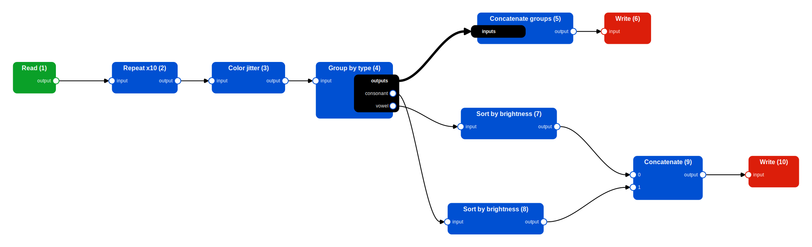

# ♻️ Workflows

## Overwiew

So far in this tutorial we always focused on simple cases where we only needed to apply a single operation to our data, with the only exception of a few cache-related examples where we saw the interactions and side-effects of two lazy operations applied sequentially. 

While applying a single operation to your data may be useful in some situations, more often than not you will need to apply multiple operations in a repeatable and organized way. One way of doing this is to write a python script that calls the right operations in the right order and that's it, but with a little extra effort you can turn your script into a Pipewine `Workflow`: a *Directed Acyclic Graph* (DAG) where nodes represent Actions (either a source, operator or sinks) and edges represent the dependencies between them.

When using Pipewine workflows, you have the following advantages:

- Pipewine can automatically draw a 2D representation of your workflow to help you (and others) understand what it does without reading your code. 
- Pipewine automatically attaches callbacks to all operations to track the progress of your workflow while it's running. Progress updates can be visualized live in a TUI (Text-based User Interface) to monitor the progress of long workflows.
- The code is transformed into a data structure that can be inspected before running it. 
- Pipewine can inject logic into your code (e.g. caches or checkpoints) without you having to write them manually.  

## Example Workflow

Instead of going through every single workflow component, we will instead focus on how to create and run workflows at a higher level, with an example use case where we perform some operations to augment and rearrange the same old dataset with letters.

Here is a summary of all the operations we want to perform in our example DAG:

1. Read a "Letter" dataset - used many times as an example toy dataset in this tutorial. 
2. Repeat the dataset 10 times.
3. Apply random color jitter to each sample.
4. Group letters by their type (either 'vowel' or 'consonant').
5. Concatenate the two (vowels and consonants) splits into a single dataset.
6. Write the dataset (A).
7. Sort the vowels by average color brightness.
8. Sort the consonants by average color brightness.
9. Contatenate the sorted splits into a single dataset.
10. Write the dataset (B).

A graphical representation of the operations involved in the workflow (this image was generated using a Pipewine utility to draw workflows). 


We start by defining the schema of our data, in this case it's the same as the one used previously in this tutorial:

``` py
class LetterMetadata(pydantic.BaseModel):
    letter: str
    color: str

class SharedMetadata(pydantic.BaseModel):
    vowels: list[str]
    consonants: list[str]

class LetterSample(TypedSample):
    image: Item[np.ndarray]
    metadata: Item[LetterMetadata]
    shared: Item[SharedMetadata]
```

Some steps of our workflow need a custom implementation, or are simply not provided by Pipewine, namely:

- The mapper that applies random color jittering (very rudimental):
``` py
class ColorJitter(Mapper[LetterSample, LetterSample]):
    def __call__(self, idx: int, x: LetterSample) -> LetterSample:
        image = x.image()
        col = np.random.randint(0, 255, (1, 1, 3))
        alpha = np.random.uniform(0.1, 0.9, [])
        image = (image * alpha + col * (1 - alpha)).clip(0, 255).astype(np.uint8)
        return x.with_values(image=image)
```
- The group-by function that separates vowels from consonants:
``` py
def group_fn(idx: int, sample: LetterSample) -> str:
    return "vowel" if sample.metadata().letter in "aeiou" else "consonant"
```
- The sort function needed to sort samples by image brightness:
``` py
def sort_fn(idx: int, sample: LetterSample) -> float:
    return float(sample.image().mean())
```
- An operation to concatenate all datasets in a dictionary of datasets. Needed because `CatOp` accepts a sequence of datasets, not a mapping. 
``` py
class GroupCat(DatasetOperator[Mapping[str, Dataset], Dataset]):
    def __call__(self, x: Mapping[str, Dataset]) -> Dataset:
        return CatOp()(list(x.values()))
```

Let's pretend we don't know anything about workflows and just write some Python code to apply the operations in the correct order:

``` py
# Input, outputs, grabber
input_folder: Path("tests/sample_data/underfolders/underfolder_0")
output_a: Path("/tmp/out_a")
output_b: Path("/tmp/out_b")
grabber = Grabber(8, 50)

# (1) Read the data
data = UnderfolderSource(input_folder, sample_type=LetterSample)()

# (2) Repeat the dataset 10 times
data = RepeatOp(10)(data)

# (3) Apply random color jitter 
# We need a checkpoint after this operation to avoid recomputing a random function! 
data = MapOp(ColorJitter())(data)
UnderfolderSink(ckpt_path := Path("/tmp/checkpoint"), grabber=grabber)
data = UnderfolderSource(ckpt_path, sample_type=LetterSample)()

# (4) Group letters by their type
groups = GroupByOp(group_fn)(data)

# (5) Concatenate the two types
data = GroupCat()(groups)

# (6) Write the dataset A
UnderfolderSink(out_a, grabber=grabber)(data)

# (7, 8) Sort the two splits by average color brightness
vowels = SortOp(sort_fn)(groups["vowel"])
consonants = SortOp(sort_fn)(groups["consonant"])

# (9) Concatenate the sorted splits 
data = CatOp()([vowels, consonants])

# (10) Write the dataset B
UnderfolderSink(out_b, grabber=grabber)(data)
```

Now, let's re-write our code using workflows, by applying the following changes:

1. Create an empty `Workflow` object named `wf` at the beginning of our code.
2. Wrap each action call using `wf.node()`. 
3. Call the `run_workflow` function at the end of our code.

``` py
# Input, outputs, grabber
input_folder: Path("tests/sample_data/underfolders/underfolder_0")
output_a: Path("/tmp/out_a")
output_b: Path("/tmp/out_b")
grabber = Grabber(8, 50)

# Create the worfklow object
wf = Workflow(WfOptions(checkpoint_grabber=grabber))

# (1) Read the data
data = wf.node(UnderfolderSource(input_folder, sample_type=LetterSample))()

# (2) Repeat the dataset 10 times
data = wf.node(RepeatOp(10))(data)

# (3) Apply random color jitter (with checkpointing)
data = wf.node(MapOp(ColorJitter()), options=WfOptions(checkpoint=True))(data)

# (4) Group letters by their type
groups = wf.node(GroupByOp(group_fn))(data)

# (5) Concatenate the two types
data = wf.node(GroupCat())(groups)

# (6) Write the dataset A
wf.node(UnderfolderSink(out_a, grabber=grabber))(data)

# (7, 8) Sort the two splits by average color brightness
vowels = wf.node(SortOp(sort_fn))(groups["vowel"])
consonants = wf.node(SortOp(sort_fn))(groups["consonant"])

# (9) Concatenate the sorted splits 
data = wf.node(CatOp())([vowels, consonants])

# (10) Write the dataset B
wf.node(UnderfolderSink(out_b, grabber=grabber))(data)

# Run the workflow
run_workflow(wf)
```

This code is very similar to the previous and it behaves the same way if executed. What changed is that instead of being executed as soon as operators are called, they are first converted into a DAG, then executed upon calling the `run_workflow` function. Nothing is done until the last line of code. 

## Workflow Creation

## Workflow Components

### Limitations

## Workflow Execution

## Event Queues and Progress Tracking

## Drawing Workflows


The `Workflow.node()` function 